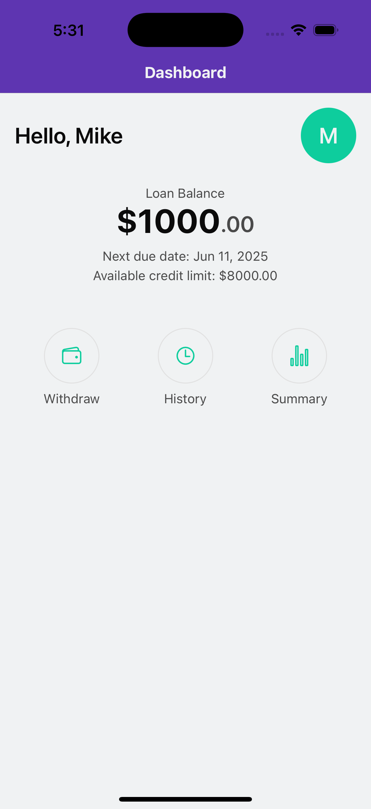
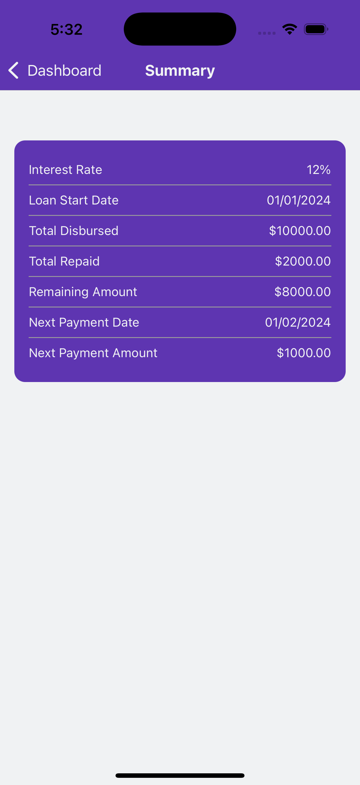
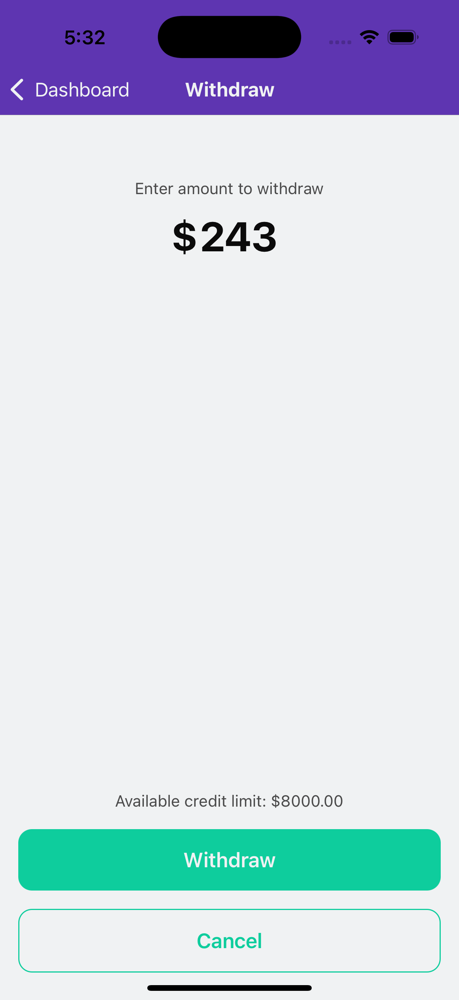
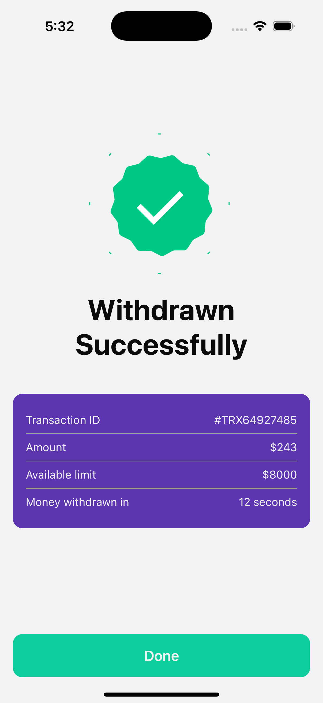
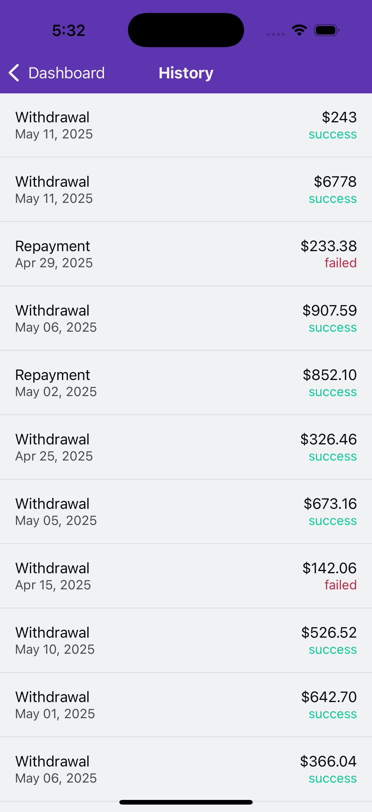

# Earnifi Mobile App

A React Native mobile application

## Overview

This project is built using React Native, providing a cross-platform mobile application that works on both iOS and Android devices. It uses following tools 

### Tools

- **React Navigation** for routing
- **Restyle** for theming and tailwind like component styling
- **Formik** and **Yup** for form state handling and validation
- **SWR** for data fetching and caching(not implemented now)
- **Zustand** for global state management as its simpler and versatile than context


## Simplifications

- Initial focus is on core features with basic UI components
- Withdrawal is the most interactive page with data on it gets stored as optimistic transaction in zustand store
- Dashboard and Loan summary are very much static and data is directly hardcoded
- History page uses a mock API which generates 50 txns and fetches 10 at a time using SWRInfinite

## Future Improvements

- Flatlist in history can be replaced with Flashlist
- Internationalization (i18n) support
- Dark mode support
- Implement comprehensive testing suite (unit, integration, and E2E tests)
- Add performance monitoring and crash reporting
- Enhance error handling and recovery mechanisms
- Add automated CI/CD pipeline
- Move to store driven data modelling for the app 


### Screenshots

#### Dashboard


#### Loan Summary


#### Withdrawal


#### Withdrawal Success


#### History



## Installation and setup

### Prerequisites

- Node.js (v14 or later)
- npm or Yarn
- Xcode (for iOS development)
- Android Studio (for Android development)
- CocoaPods (for iOS dependencies)

### Installation

1. Clone the repository:
```bash
git clone [repository-url]
cd earnifi
```

2. Install dependencies:
```bash
# Using npm
npm install
```

3. Install iOS dependencies:
```bash
bundle install
bundle exec pod install
```

### Running the Application

1. Start the Metro bundler:
```bash
# Using npm
npm start
```

2. Run on iOS:
```bash
# Using npm
npm run ios
```

3. Run on Android:
```bash
# Using npm
npm run android
```